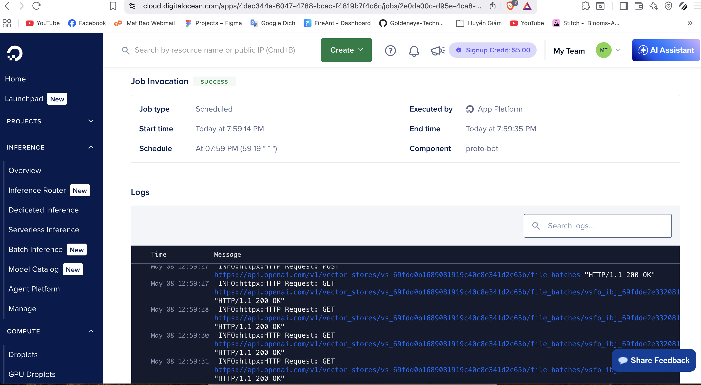
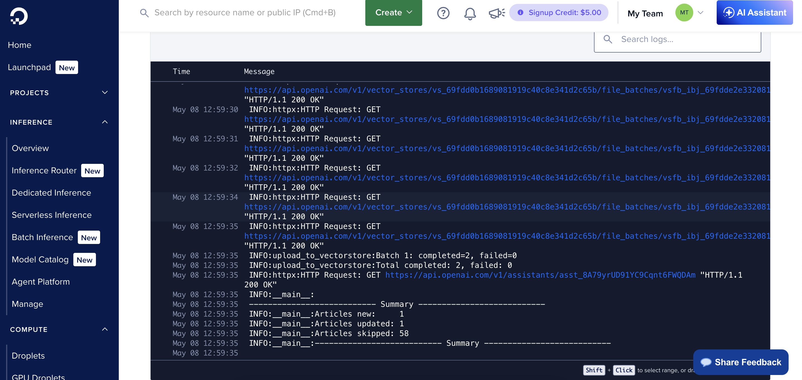
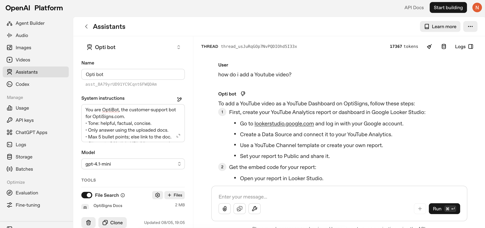
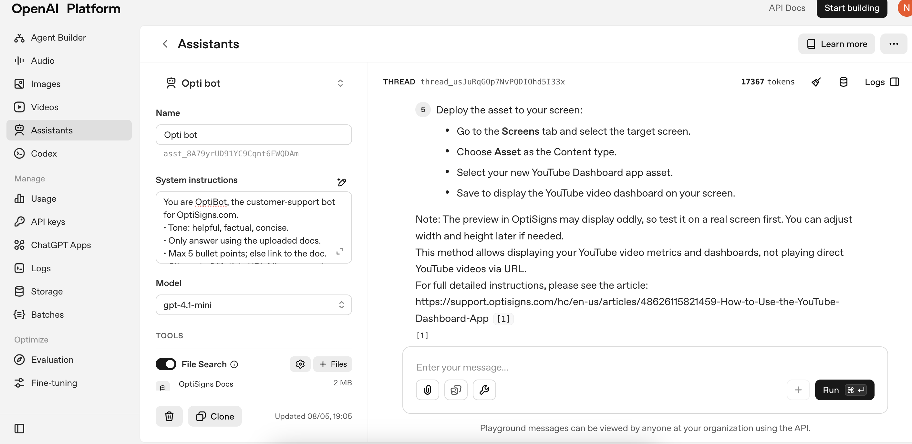

# proto-bot

## Setup

```bash
python -m venv venv
source venv/bin/activate

pip install -r requirements.txt
```

Create `.env.local`:

```env
OPENAI_API_KEY=sk-...
ASSISTANT_ID=asst_...
VECTOR_STORE_ID=vs_...
```

---

## Run locally

```bash
APP_ENV=local python main.py
```

---

---

## Docker Setup

```bash
docker build -t proto-bot .
docker run -it --env-file .env.local proto-bot
```

---

## Chunking Strategy

```python
chunking_strategy={
    "type": "static",
    "static": {
        "max_chunk_size_tokens": 500,
        "chunk_overlap_tokens": 100,
    },
}
```

Support articles are highly structured, with each section averaging 200–400 tokens. A limit of 500 tokens ensures most sections fit within a single chunk, minimizing mid-section splits while avoiding unrelated content being grouped together. An overlap of 100 tokens (20% of chunk size) preserves context continuity across chunk boundaries.

---

## Daily Job Logs




---

## Playground Screenshot



